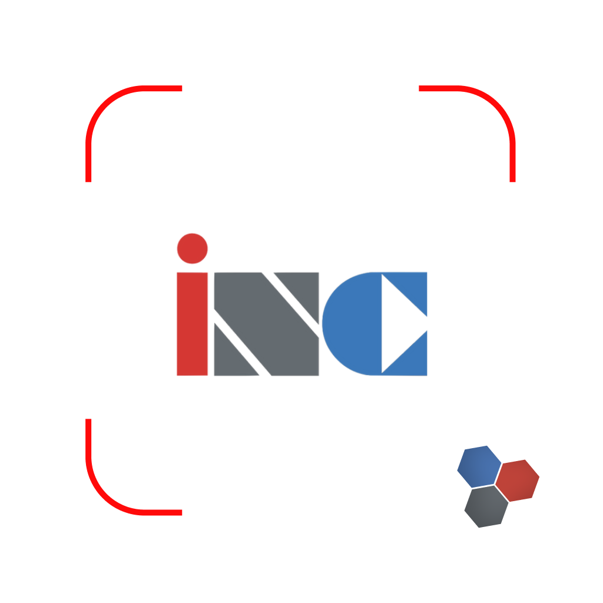
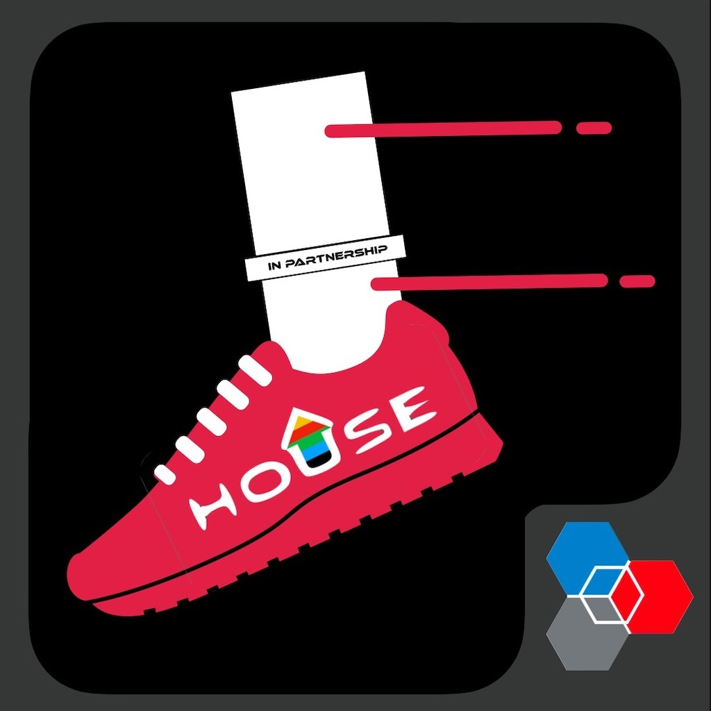
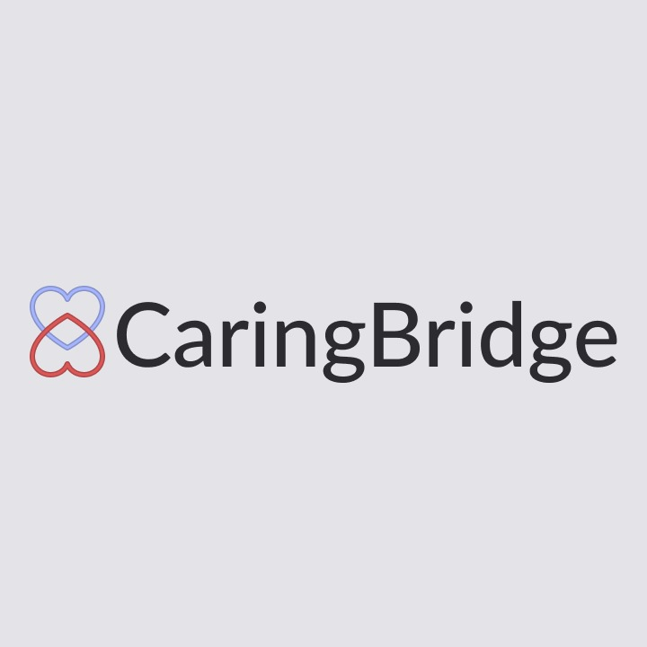
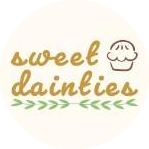
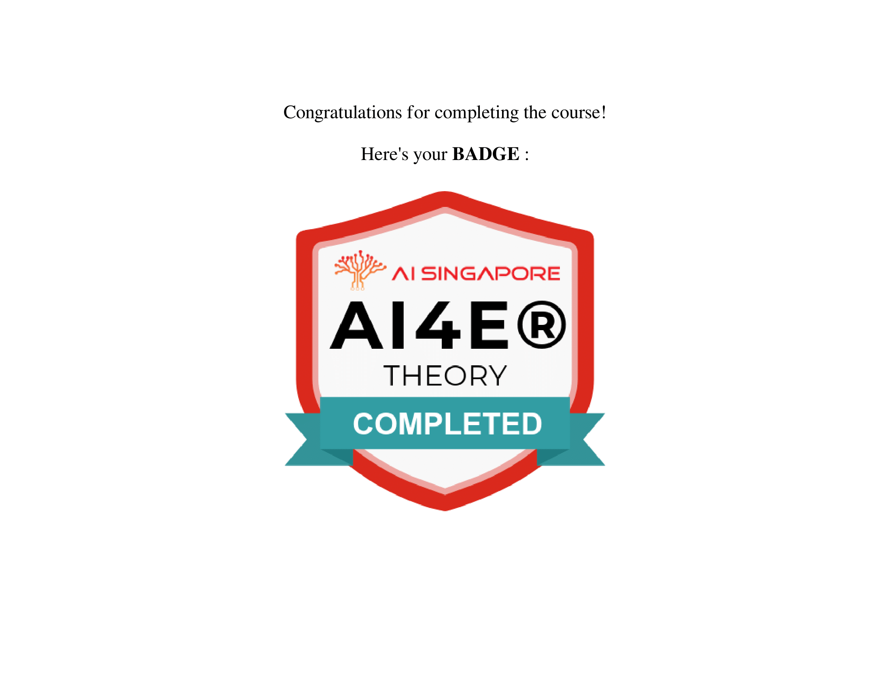
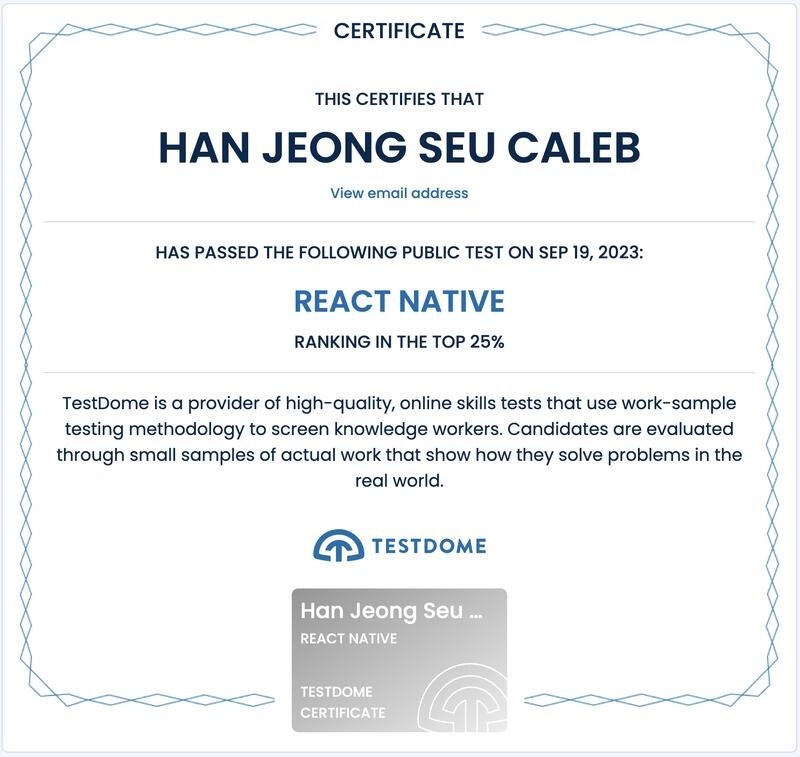

# Hey! I'm Caleb!

I'm a 15 year old passionate Web/Mobile developer and Machine Learning Engineer. Welcome to my GitHub profile! Feel free to explore my repositories, contributions, and projects.

- 🔭 I’m currently working on **[KKH Paediatric Anaesthesia Revamp](https://github.com/kidscoots101/KKH-Paediatrics)**
- 🌱 I’m currently learning **Machine Learning** and **SwiftUI**
- 👯 I’m looking to collaborate on **open source projects**
- 💬 Ask me about **web development**, **React**, or **anything tech-related**

---

## 🧍‍♂️ About me
I current serve as the Chief Technology Offider (CTO) of SST Inc, an incubator which helps nurture startups along with like-minded programmers. I craft the React curriculum in the club, teach and assist students with any technical challenges or issues they may face. I started off learning React on my own, curious to see the endless possibilites app development offers. In 2022, I signed up as a Task Force member to help CTOs teach React. Being inspired, I applied for the CTO position in 2023 and here I am!

## What I do
- 💻React
  - 📱 Both Native and Web
- ☁️ Cloud Computing 
- 🐍 Python
  - 👨‍💻Competitive programming
  - 🌇 Algorithms, Image Processing

## 🚀 Projects
    

### [AttendINC](https://github.com/kidscoots101/inc-terminal-attendance)
It's an attendance Web app for people in my club to take attendance. It made the attendnace taking process 100x faster due to the students scanning in themselves, instead of the admin personnel manually accounting for everyone's attendance. Check it out here: https://bit.ly/attendinc

### [GrowCalth](https://apps.apple.com/sg/app/growcalth/id6456388202?uo=2)
With an in-built step-tracker, it tracks the steps of SST Students and increases the house spirit among them. This further encourages students to contribute to their house points

### [KKH Paediatric Anaesthesia Revamp](https://github.com/Aathithya-J/KKH-Revamp/tree/devh)
A medical app for the doctors and nurses of KKH.

---
## 🏆 Certifications
 

---

## 📫 Let's Connect

- LinkedIn: [Caleb Han](https://www.linkedin.com/in/caleb-han-792349235/)
- Personal Website: [calebhan.vercel.app](https://calebhan.vercel.app/)

---
---

## ☕ Let's Chat

Shoot me an email over at calebhan08js@gmail.com if you would like to chat!

<!---
kidscoots101/kidscoots10
1 is a ✨ special ✨ repository because its `README.md` (this file) appears on your GitHub profile.
You can click the Preview link to take a look at your changes.
--->
